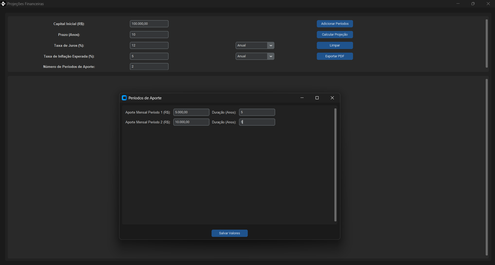

## Descrição do Projeto

Este projeto é uma aplicação desktop do tipo GUI (Graphical User Interface) feita em Python para cálculos de projeções financeiras. Foi desenvolvida  utilizando a biblioteca `customtkinter`, que oferece uma interface gráfica intuitiva, gráficos interativos feitos com `matplotlib` e `seaborn`, e a possibilidade de exportação de um relatório em PDF via `reportlab`.

## Funcionalidades

### Cálculos Financeiros

- Projeção de valor futuro com e sem aportes (regime antecipado).
- Cálculo de taxa de juros real, considerando inflação.
- Renda perpétua (vitalícia) com base no valor acumulado.
- Cálculo a partir de valores de aportes variáveis por período de tempo





### Exportação do Relatório

- Relatórios em PDF contendo os dados de entrada, resultados e gráfico da projeção
- Personalização com sigla ou nome do cliente.

### Gráfico Interativo

- Visualização da evolução patrimonial (nominal e real, com e sem aportes).
- Cursor interativo para exibir valores em pontos específicos.

## Requisitos

- Python 3.8+
- Bibliotecas: `pandas`, `numpy`, `matplotlib`, `seaborn`, `customtkinter`, `reportlab`, `pillow`

### Instalação

```bash
pip install pandas numpy matplotlib seaborn customtkinter reportlab pillow
```

## Execução
- Execute o comando do arquivo ``` exec.ps1 ``` para gerar o arquivo executável do programa
